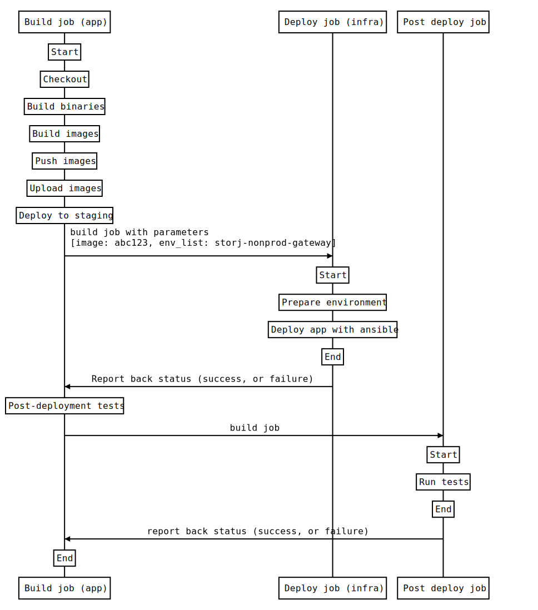

# Automated staging deploys

## Abstract

This document describes the current process of deploying to the hosting
environment for Storj edge services such as Gateway-MT and Linksharing, and
how we may automatically deploy to them.

## Background

Edge services currently have an automated build and test pipeline for verifying
a commit works correctly against a test suite. This works well for catching
issues during development, however, there's been times when a change was
deployed to staging, and didn't work as expected due to differences from local
development environment to the configuration on the remote hosting
infrastructure.

There are staging environments currently, but aren't often used outside the QA
team. The process of deploying to staging is manual, and can take some time to
complete, which discourages the use of them altogether.

Currently when someone wants to test the latest build of an edge service on a
staging environment, they must run through a release process. Taking Gateway-MT
as an example:

1. Tag the current `main` branch commit and push to repo.
2. Wait for the Jenkins private build to complete.
3. Note down the docker image that was generated by the build.
4. Modify the environment vars to update the docker image tag.
5. Open a pull request to change the image tag, and ask someone to review the change. Wait for someone to merge it.
6. Run the deployment Jenkins job with the correct environment parameter.

To deploy to production, steps 4-6 need to be run using the same image that was
deployed to staging.

## Design

We outline a possible solution for how to improve this situation by automatically
deploying changes to staging as commits to `main` branch, or tags are pushed to
the given service's code repository.

The idea is to start with a "light touch" approach to get an idea of how well it
works before investing more time into this process, with a longer term goal to
be deploying faster to production once there is trust and more automated
post-deployment tests.

We propose to connect the build and deploy jobs, so the end of a `main` or tag
build will trigger the deploy job. A post-deployment job would be a new
addition, used to ensure the newly deployed service works as expected using a
suite of tests that automatically run.

### Environment to use

Currently, the `nonprod` environment is used by QA for manually testing Edge
service releases. We'll be creating a new copy of this environment "QA Edge"
for manual release testing, freeing up `nonprod` for continuous deploy purposes.

### Running the deploy job

The idea is to run this as a downstream job in Jenkins at the last stage of the
build job, if we're building a commit pushed to the `main` branch or a
tag was pushed. This can be specifically configured using Jenkins to only
run on these specific branch or tag conditions. Any other builds for GitHub
pull requests, or Gerrit _will not_ deploy to staging and operate as they
currently do.

The image tag for the `nonprod` environment could be set to `latest` in the vars
config file, for example `storjlabs/gateway-mt:latest`. This would deploy the
latest build whenever the deploy job is triggered.

Note that the deploy job can only ever be run once at any given time, so any
commits in quick succession to the `main` branch, for example, would result in
queued deployment jobs instead of being run simultaneously. This is already
configured in Jenkins as the "Do not allow concurrent builds" setting.

### Post-deployment tests

New post-deployment jobs for Gateway-MT and Linksharing will be created which
will run tests against the newly deployed service on the environment, so we can be
reasonably confident it's working as expected. Keys for accessing gateway and
linksharing can be stored and retrieved as Jenkins credentials.

These jobs can be run at any time, just as the deployment jobs are, but will be
run automatically as a downstream job after a successful deployment to staging.

We may have some existing tests we could re-use from the current Gateway-MT
test suite, otherwise some new tests need to be written.

## Rationale

Automating our staging deployments should improve quality of edge services
overall. We can catch bugs and issues that arise on staging earlier, during
development, as code is continually deployed and tested on an environment
closely resembling what customers are using.

Using our existing Jenkins setup seemed like the most sensible thing to do,
especially in terms of security as they're internally hosted, and have
privileged access to our servers already.

There's been mention of changes to the way we do infrastructure, such as a new
container orchestration which could make deployments much easier, but we aren't
there yet.

## Alternatives

A simple approach could be using something like [Watchtower](https://containrrr.dev/watchtower/).
That would be a quick way to set a continuous roll out, but configuring it to
notify and run hooks would deviate from CI pipelines and require us to
introduce another way of configuring notifications and post-deploy hooks.

Using something entirely new like GitHub Actions could be interesting as an
alternative to Jenkins, but I'm not sure we'd be willing to allow third-party
systems to access our servers. This could be mitigated by restricting access,
e.g. create a specific SSH user for the deploy user, but I don't believe it's
trivial to restrict docker command line usage, which is how we're deploying
edge services currently. In Kubernetes, this could be achieved using RBAC, but
we don't deploy edge services using Kubernetes, and doing that would be another
topic altogether. ;-)

## Out of scope

* Rollback on post-deployment test failure. Edge team would be alerted to any
problems with the staging environment, but no automatic rollback would be
performed.