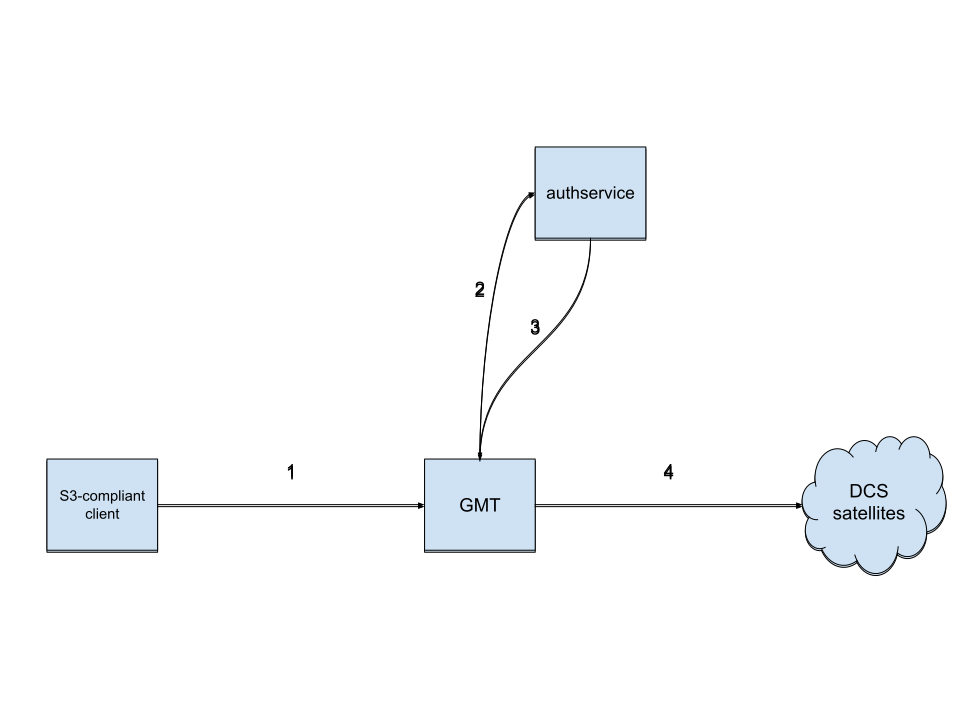

# Security/auth

## Abstract

This document describes Gateway-MT previous auth process design and our efforts
to redesign the process with as least modifications as possible but making the
service more secure and maintainable. The proposed design focuses on avoiding
too many changes to the MinIO fork.

## Background

A multi-tenant gateway requires handling users' security credentials with utmost
precision. Managed credentials include Access Key ID & Secret Access Key
(AWS/S3-compatibility) and satellite-specific Access Grant to access the Storj
network. These two groups of credentials are tied together. MinIO
(instrumentation we use for the AWS/S3-compatibility) allows multiple users with
different sets of Access Key ID and Secret Access Key to connect to the same
instance [0], but it seems to us that it's not entirely compatible with our
fashion. Specifically, MinIO doesn't allow us to hold Access Grants somewhere
safe, and we must verify the request using Secret Access Key before
incorporating Access Grant into the flow (minimizing attack surface). Previous
efforts to use MinIO resulted in forking MinIO and heavily modifying its
internals to make this flow more embedded into MinIO. Since MinIO is a large
codebase and changing one thing could cause a serious vulnerability to arise, we
should move auth process out of MinIO as much as we can.

This document serves as an extension to previous design documents for
Gateway-MT. It doesn't try to redesign everything from scratch but rather
briefly describe the current implementation, highlight important features we
need to keep and walk through what we want to change.

## Design

Aside from MinIO embedded into Gateway-MT service, we use a component named
_authservice_. This service holds Access Grants, returning them to Gateway-MT in
the context of a particular request. _authservice_ can be a service spawned as a
separate process (current implementation) or the same process as Gateway-MT
(hybrid (micro)service). Gateway-MT verifies requests' signatures (holding
Access Key IDs and Secret Access Keys), and only if the request is valid asks
_authservice_ for the corresponding Access Grant.

Users deposit their Access Grants in _authservice_ before working with
Gateway-MT.

Auth flow:
1. Extract necessary login credentials and validate the request signature
   (Signature Version 2/4). Do this as either part of the Server struct
   receivers or using an HTTP middleware [1];
2. Request Access Grant corresponding to received Access Key ID;
3. Retrieve Access Grant into the HTTP request context;
4. With the Storj Object API implementation, extract Access Grant from the
   context. Use these credentials to access the Storj network.

Previously request validation was implemented as a custom MinIO IAM plugin. This
solution required numerous precise changes to the MinIO code, requiring Storj
developers to be highly familiar with MinIO's internals. Further, both Storj's
IAM and Object API plugins to MinIO were abstracted from the HTTP
request/response layer, which limited Storj's ability to extend and test the
code. Finally, we recently have changed how we instantiate MinIO's HTTP
handlers, making it easy for us to validate requests outside the MinIO IAM
system.

## Rationale

This approach requires users to keep their credentials in _authservice_. An
alternate approach could be sending Access Grant as Access Key ID. However,
sending Access Grant with every request poses a significant security risk. Even
with secure transport, we are exposing users to a larger attack window. There
has been an initial trial to send Access Grants as Access Key IDs. Since Access
Grants are serialized macaroons, they are too large to fit in expected Access
Key ID sizes with most 3rd party S3 libraries.

## Implementation

As previously mentioned, we already have components that require slight
modifications to account for the new auth flow. The most significant change will
be changing/reverting changes in the MinIO fork and cleaning up Gateway-MT.

We must continue to encrypt users' Access Grants at rest. We don't need to hold
Access Key ID in its open form (just a hash), so we could continue to use it to
encrypt and decrypt Access Grant.

Since Gateway-MT performs auth process, we will disable
authentication/authorization in MinIO (the simplest way to do this is probably
to enable anonymous policy globally [2])).

We should also make _authservice_ return a new, time-limited macaroon [3] and
not the original Access Grant. We can do this iteratively.

## Wrapup

This blueprint will be archived by Artur Wolff when completed. Most probably,
there will be no need for changes to the documentation. If we would be able to
secure the process better, we could state that there.

## Open issues

None at the moment.

## References

- [0] https://docs.min.io/docs/minio-multi-user-quickstart-guide.html
- [1] https://drstearns.github.io/tutorials/gomiddleware/
- [2] https://stackoverflow.com/a/66542995
- [3] https://pkg.go.dev/storj.io/uplink#hdr-Multitenancy_in_a_Single_Application_Bucket
