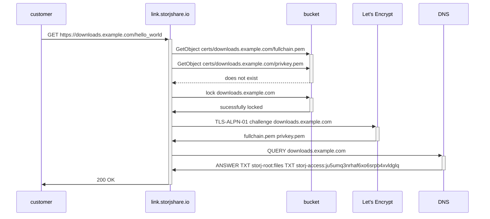

# Linksharing Secure Custom Domain Support (TLS)

## Abstract
This document describes how to add HTTPS support for custom domains in Linksharing.

## Background
Customers who want to provide access to objects in Storj buckets to their own end users from a web frontend use Linksharing. When they want (or need) to have a custom domain that is secured with TLS for the content served, the url must be proxied through a CDN such as Cloudflare or BunnyCDN. A couple problems unfold as a result:

  1. Proxying certain types of content, such as streaming video, is against the terms of service for providers such as Cloudflare – so these customers are stuck
  2. CDN providers (without a TOS restriction) cache content, reducing the amount of egress from Storj and adding an unnecessary third party

Storj DCS customers often have strict requirements from their own customers, including strict security reviews and policies. There are customers who have to whitelist every domain that can be accessed, and the security teams won’t approve a generic hosting domain. For example a customer with devices used in the field (e.g. for surveying customers) with very locked down internet needed to access linksharing. Company policy was a whitelisted set of domains and getting link.storjshare.io added was quite an arduous process.

## Design

### Generating Storj managed certificates
The certificates are issued on-demand (during the TLS handshake) through Let's Encrypt with the TLS-ALPN-01 challenge.
1. Customer makes a share request with the uplink cli.
```
uplink share --dns downloads.example.com sj://files
```
2. Customer updates their DNS info with the output from the uplink cli.
```
downloads.example.com    	IN	CNAME	link.storjshare.io.
txt-downloads.example.com	IN	TXT  	storj-root:files
txt-downloads.example.com	IN	TXT  	storj-access:ju5umq3nrhaf6xo6srpb4xvldglq
```
3. When the share is accessed linksharing loads the certificate matching the SNI.
4. If the certificate is not in the in-memory certificate cache it checks the certificate store.
5. If the certificate does not exist in the store and the CNAME is valid, request a certificate store domain-lock.
6. If the domain-lock succeeds, request a certificate, otherwise drop the request. Additional requests made to the instance holding the lock can be held while the certificate is issued.
7. The certificate validation process runs and the new certificate is added to the store.



### Storing
The Certificates are stored in one private Storj controlled DCS bucket. The bucket shares certificates and other TLS resources need for the challenges between all the linksharing instances.

### Renewing
When a share is accessed the certificate is renewed if it expires in less than 30 days. Certificates for shares that are not accessed will expire and be reissued on the next access.

## Rationale
On-demand Storj managed certificates allow existing and new shares to support https without any additional customer burden.  The first access of a share will take extra time while the certificate is issued. The customer should access a share to generate the certificate and warm the cache if the extra latency on first access is an issue.  The cache is lost when a linksharing instance terminates.  In future versions the cache miss latency could be improved by adding an intermediate cache like authservice.

The TLS-ALPN-01 challenge was chosen because we don't have to open port 80 (HTTP-01), don't want to wait for dns propagation, and we don't support wildcard certs (DNS-01)

On-access renewals are used for built-in garbage collection of unused certificates and for a simpler implementation using off-the-shelf components like certmagic.

DCS does not have the functionality necessary to make real locks. A pseudo lock system that checks for a lock file and then creates it in separate requests may allow more that one instance to obtain the lock. Additionally it may be temporarily worse until https://github.com/storj/storj/issues/4788 is implemented.  It's not expected that pseudo locks will be a significant problem in practice and in the worst-case scenario Let's encrypt will issue a small number of duplicate certificates.

## Implementation
The implementation could be split into two phases.
1. Terminate TLS in linksharing
2. Add custom domain support
This allows time for the infrastructure and deployment changes to take place while the second phase is being developed.

## Wrapup
This blueprint will be archived by Artur Wolff. The Linksharing Service documentation, Uplink CLI, and Host a Static Website how-to will need to be updated.
