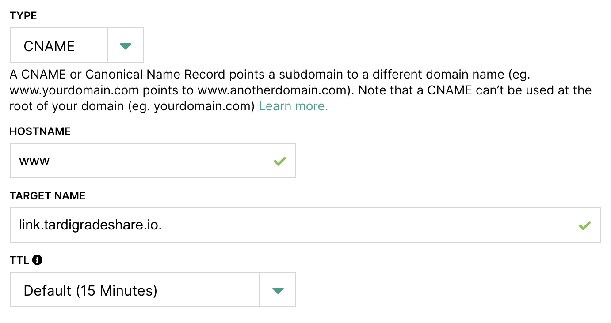
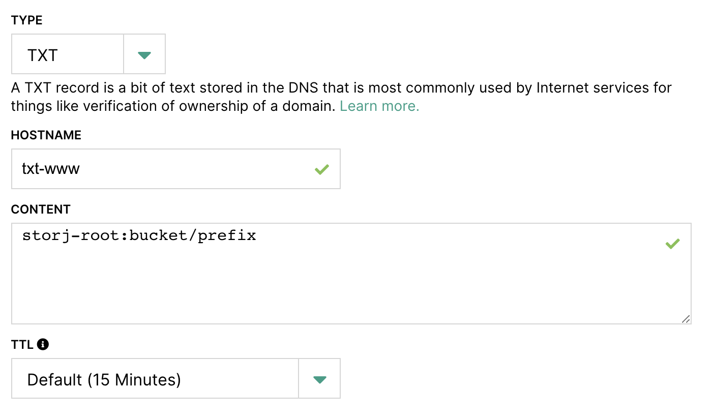
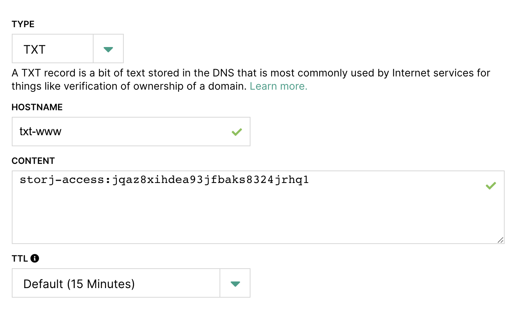

# Link Sharing Service

## Building

```
$ go install storj.io/gateway-mt
```

## Configuring

### Development

Default development configuration has the link sharing service hosted on
`localhost:20020` serving plain HTTP.

```
$ linksharing setup --defaults dev
```

### Production

To configure the link sharing service for production, run the `setup` command
using the `release` defaults. An required argument is the location of the geo-location database.
You must also provide the public URL for the sharing service, which is used to construct URLs returned to
clients. Since there is currently no server affinity for requests, the URL
can point to a pool of servers:

```
$ linksharing setup --defaults release --geo-location-db <PATH TO FILE> --public-url <PUBLIC URL>
```

**NOTE**: Please follow this link for instructions how to install/download the geo-location database:
https://dev.maxmind.com/geoip/geoipupdate/

Default release configuration has the link sharing service hosted on `:20021`
serving HTTPS using a server certificate (`server.crt.pem`) and
key (`server.key.pem`) residing in the working directory where the linksharing
service is run.

You can modify the configuration file or use the `--cert-file` and `--key-file`
flags to configure an alternate location for the server keypair.

In order to run the link sharing service in release mode serving HTTP, you must
clear the certificate and key file configurables:

```
$ linksharing setup --defaults release --public-url <PUBLIC URL> --cert-file="" --key-file="" --address=":20020"
```

**WARNING** HTTP is only recommended if you are doing TLS termination on the
same machine running the link sharing service as the link sharing service
serves unencrypted user data.

## Running

After configuration is complete, running the link sharing is as simple as:

```
$ linksharing run
```

## Standard Linksharing with Uplink
Anything shared with `--url` will be readonly and available publicly (no secret key needed).

`uplink share --url sj://<path>`

results in

`https://link.storjshare.io/s/jqaz8xihdea93jfbaks8324jrhq1/<path>`

## Custom URL configuration and static site hosting with Uplink

You can use your own domain and host your website on Storj with the following setup.

0. Upload your static site and other files to Storj using [Uplink](https://docs.storj.io/getting-started/uploading-your-first-object/set-up-uplink-cli)
or [S3 gateway](https://docs.storj.io/api-reference/s3-gateway). Download the [Uplink Binary](https://docs.storj.io/getting-started/uploading-your-first-object/set-up-uplink-cli).

1. Share an object or path to an object.
   If you are sharing an entire bucket or sub-folder, you will want to name your home page index.html.
   Anything shared with `--dns` will be readonly and available publicly (no secret key needed).

   `uplink share --dns <hostname> sj://<path>`

   Prints a zone file with the information needed to create 3 dns records. Remember to update the $ORIGIN with your domain name. You may also change the $TTL.

   ```
   $ORIGIN example.com.
   $TTL    3600
   <hostname>    	IN	CNAME	link.storjshare.io.
   txt-<hostname> 	IN	TXT  	storj-root:<path>
   txt-<hostname> 	IN	TXT  	storj-access:<access key>
   ```
   For example `uplink share --dns www sj://bucket/prefix` will output:
   ```
   $ORIGIN example.com.
   $TTL    3600
   www    	IN	CNAME	link.storjshare.io.
   txt-www	IN	TXT  	storj-root:bucket/prefix
   txt-www	IN	TXT  	storj-access:jqaz8xihdea93jfbaks8324jrhq1
   ```

2. Create a CNAME record on your hostname using our linksharing common URL `link.storjshare.io.` as the target name.

    

3. Create 2 TXT records, prepending `txt-` to your hostname.

    a. Root Path: the bucket, object prefix key, or individual object that you want your root domain to resolve to.

    

    b. Access Key: the readonly and public access key to your root path.

    

4. You can check to make sure your dns records are ready with `dig @1.1.1.1 txt-<hostname>.<domain> TXT`

5. Without further action, your site will be served with http. You can secure your site by using a https proxy server such as [Cloudflare](https://www.cloudflare.com/)

6. Optionally, if you create a page titled '404.html' in the root of your shared prefix, it will be served in 404 conditions.

7. That's it! You should be all set to access your website e.g. `http://www.example.test`

[Maxmind]: https://dev.maxmind.com/geoip/geoipupdate/

## Custom response metadata

Linksharing will respond with certain headers if they are set on an object's metadata.

This metadata can be set when uploading a file using either native Storj upload using Uplink, or using an S3 gateway.

A few common examples:

* Uplink CLI: `uplink cp /tmp/myfile.txt sj://files/myfile.txt --metadata '{"content-type":"text/html","cache-control":"no-cache"}'`
* AWS S3 CLI: `aws s3 cp /tmp/myfile.txt s3://files/myfile.txt --content-type text/html --cache-control no-cache`

The following headers can be customized:

* `Content-Type`
* `Cache-Control`
* `Content-Encoding`

Linksharing will look for metadata header names in an object by the following order:

* `Content-Type` (canonical form)
* `content-type` (all lowercase, typically how S3 gateway sets this header metadata on upload)
* any other case that is found first in the list

Metadata header names set through AWS S3 CLI or SDKs will be lowercase. Uplink currently does not automatically normalize these, so it is recommended to consistently use lowercase header names when setting metadata with Uplink if you're using both Uplink and S3 to interact with your storage.

See sections below for further details.

### Content-Type

This header indicates the media type of content.

If no type is set in metadata, Linksharing will attempt to detect the type based on the file extension of the object key. It will also detect if a default value of `application/octet-stream` or `binary/octet-stream` is set. S3 clients and SDKs typically set these defaults automatically if a type was not specified on upload.

If you wish to avoid this detection on default types, you can set `X-Content-Type-Options: nosniff` in the request headers.

If a type is missing from metadata and detection is disabled, then type defaults to `application/octet-stream`.

See [Content-Type - HTTP - MDN Web Docs](https://developer.mozilla.org/docs/Web/HTTP/Headers/Content-Type) for more information.

### Cache-Control

This header influences caching behavior of browsers and shared caches (e.g. proxies, CDNs).

Linksharing does not set a default for this header.

See [Cache-Control - HTTP - MDN Web Docs](https://developer.mozilla.org/docs/Web/HTTP/Headers/Cache-Control) for more information.

### Content-Encoding

This header indicates any encoding applied to the content.

This is useful for indicating already compressed content that should be decompressed by the client when downloaded from Linksharing. For example, for static web assets. In the case of a CSS file, you would compress the file and upload it with `Content-Type: text/css` and `Content-Encoding: gzip` as the metadata.

Linksharing does not set a default for this header unless you are accessing a compressed zip file, in which case it will be set to `gzip`.

See [Content-Encoding - HTTP - MDN Web Docs](https://developer.mozilla.org/docs/Web/HTTP/Headers/Content-Encoding) for more information.

## LICENSE

This project is licensed under the AGPL-v3. See LICENSE for more.
