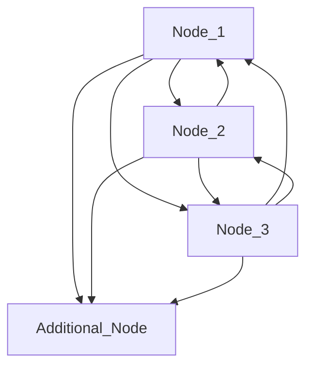

Auth Database
=============

Package badgerauth implements eventually consistent auth database built on top of [BadgerDB](https://dgraph.io/docs/badger/).

The implementation is based on the design from the [New Auth Database](https://github.com/storj/gateway-mt/blob/bd1f6f8ea2d48933524aa88cfd45469b2414e382/docs/blueprints/new-auth-database.md) blueprint.

The implementation differs from what's been described in the blueprint slightly. Specifically, the ability to invalidate and delete records through the KV interface has been removed, which drastically simplified implementation. Mainly we don't need to handle special cases around invalidation/deletion, handle out-of-sync nodes (there won't be out-of-sync nodes), and prune the replication log since we won't delete anything through the KV interface.

## Usage

With badgerauth as auth database backend, authservice acts as a standalone database node that's designed to be run in a cluster (but it can run alone, too).

### Configuration

To run authservice with badgerauth backend `--kv-backend='badger://'` must be specified and there are several parameters than tune the cluster/storage engine.

Several parameters need to be specified to run a production-grade cluster; others are optional or have otherwise sensible default values. Required parameters are:

- `node.id`
- `node.path`
- `node.certs-dir`
- `node.join`

`node.address` is a commonly changed parameter, and there are also backup-related parameters that might be considered required depending on individual needs.

#### Storage engine configuration

|         **Parameter**         |                                 **Description**                                |      **Default value**      |
|:-----------------------------:|:------------------------------------------------------------------------------:|:---------------------------:|
| `node.conflict-backoff.delay` |               The active time between retries, typically not set               |             `0s`            |
|  `node.conflict-backoff.max`  |                     The maximum total time to allow retries                    |             `5m`            |
|  `node.conflict-backoff.min`  |                        The minimum time between retries                        |           `100ms`           |
|       `node.first-start`      |                  Whether to allow starting with empty storage                  | dev/release: `true`/`false` |
|           `node.id`           |                         Unique identifier for the node                         |                             |
|          `node.path`          | A path where to store data (WARNING: data will be stored in RAM only if empty) |                             |

`node.conflict-backoff.*` are settings related to backing off for retrying execution of write transactions. The current underlying storage engine uses concurrent ACID transactions; hence transactions need retrying in a rare case of conflict (see https://dgraph.io/blog/post/badger-txn/).

`node.first-start` is needed while starting nodes in production for the first time and shouldn't ever be used later on. It guards against dangerous restarts of nodes with empty storage attached that often signals underlying storage stopped being reliable.

#### Backups configuration

|          **Parameter**          | **Default value** |
|:-------------------------------:|:-----------------:|
|   `node.backup.access-key-id`   |                   |
|       `node.backup.bucket`      |                   |
|      `node.backup.enabled`      |      `false`      |
|      `node.backup.endpoint`     |                   |
|      `node.backup.interval`     |        `1h`       |
|       `node.backup.prefix`      |                   |
| `node.backup.secret-access-key` |                   |

#### Cluster configuration

|        **Parameter**        |                    **Description**                   | **Default value** |
|:---------------------------:|:----------------------------------------------------:|:-----------------:|
|        `node.address`       |           address that the node listens on           |      `:20004`     |
|       `node.certs-dir`      | directory for certificates for mutual authentication |                   |
|         `node.join`         |   comma-delimited list of cluster peers (addresses)  |                   |
| `node.replication-interval` |                how often to replicate                |       `30s`       |
|   `node.replication-limit`  |   maximum entries returned in replication response   |       `1000`      |

Note that it's not possible to start the cluster without mutual authentication. Currently, the only supported transport for replication is TLS (except for unit tests where it's possible to start an insecure cluster). For details, see the Cluster security configuration section.

#### Cluster security configuration

Disclaimer: the following documentation section is heavily inspired by https://www.cockroachlabs.com/docs/v22.1/create-security-certificates-openssl (badgerauth's cluster security configuration is similar).

To secure the cluster's inter-node communication, a Certificate Authority (CA) certificate that has been used to sign keys and certificates (SSLs) for nodes must be provided.

To create these certificates and keys, use [`openssl` commands](https://wiki.openssl.org/index.php/), or use a custom CA (for example, a public CA or organizational CA).

##### Subcommands

|                                **Subcommand**                               |                            **Usage**                           |
|:---------------------------------------------------------------------------:|:--------------------------------------------------------------:|
| [`openssl genrsa`](https://www.openssl.org/docs/manmaster/man1/genrsa.html) |                   Create an RSA private key.                   |
|    [`openssl req`](https://www.openssl.org/docs/manmaster/man1/req.html)    | Create CA certificate and CSRs (certificate signing requests). |
|     [`openssl ca`](https://www.openssl.org/docs/manmaster/man1/ca.html)     |             Create node certificate using the CSRs.            |

##### Configuration files

To use [`openssl req`](https://www.openssl.org/docs/manmaster/man1/req.html) and [`openssl ca`](https://www.openssl.org/docs/manmaster/man1/ca.html) subcommands, the following configuration files are needed:

| **Filename pattern** |       **File usage**      |
|:--------------------:|:-------------------------:|
|       `ca.cnf`       |   CA configuration file   |
|      `node.cnf`      | Server configuration file |

##### Certificate directory

Access to a local copy of the CA certificate and key to create node certificates using the OpenSSL commands is needed. It's recommended to create all certificates (node and CA certificates) and node keys in one place and then distribute them appropriately. Store the CA key somewhere safe and keep a backup; if lost, it will not be possible to add new nodes to the cluster.

##### Required keys and certificates

Use the [`openssl genrsa`](https://www.openssl.org/docs/manmaster/man1/genrsa.html) and [`openssl req`](https://www.openssl.org/docs/manmaster/man1/req.html) subcommands to create all certificates and node keys in a single directory, with the files named as follows:

| **Filename pattern** |       **File usage**       |
|:--------------------:|:--------------------------:|
|       `ca.crt`       |       CA certificate       |
|      `node.crt`      |     Server certificate     |
|      `node.key`      | Key for server certificate |

Note the following:

- The CA key should not be uploaded to the nodes, so it should be created in a separate directory.
- Keys (files ending in `.key`) must meet the permission requirements check on macOS, Linux, and other UNIX-like systems. <!-- TODO(artur): do they? -->

##### Example of creating security certificates using OpenSSL

###### Step 1. Create the CA key and certificate pair

1. Create two directories:

```console
$ mkdir certs safe-directory
```

- `certs`: create a CA certificate and all node certificates and keys in this directory, and then upload the relevant files to the nodes.
- `safe-directory`: create a CA key in this directory and then reference the key when generating node certificates. After that, keep the key safe and secret; do not upload it to nodes.

2. Create the `ca.cnf` file and copy the following configuration into it.

The CA certificate expiration period can be set using the `default_days` parameter. Using the default value of the CA certificate expiration period, which is 365 days, is recommended.

```
# OpenSSL CA configuration file
[ ca ]
default_ca = CA_default

[ CA_default ]
default_days = 365
database = index.txt
serial = serial.txt
default_md = sha256
copy_extensions = copy
unique_subject = no

# Used to create the CA certificate.
[ req ]
prompt=no
distinguished_name = distinguished_name
x509_extensions = extensions

[ distinguished_name ]
organizationName = Storj

[ extensions ]
keyUsage = critical,digitalSignature,nonRepudiation,keyEncipherment,keyCertSign
basicConstraints = critical,CA:true,pathlen:1

[ signing_policy ]
organizationName = supplied

# Used to sign node certificates.
[ signing_node_req ]
keyUsage = critical,digitalSignature,keyEncipherment
extendedKeyUsage = serverAuth,clientAuth

# Used to sign client certificates.
[ signing_client_req ]
keyUsage = critical,digitalSignature,keyEncipherment
extendedKeyUsage = clientAuth
```

3. Create the CA key using the [`openssl genrsa`](https://www.openssl.org/docs/manmaster/man1/genrsa.html) command:

```console
$ openssl genrsa -out safe-directory/ca.key 2048
```

```console
$ chmod 400 safe-directory/ca.key
```

4. Create the CA certificate using the [`openssl req`](https://www.openssl.org/docs/manmaster/man1/req.html) command:

```console
$ openssl req -new -x509 -config ca.cnf -key safe-directory/ca.key -out certs/ca.crt -days 365 -batch
```

5. Reset database and index files:

```console
$ rm -f index.txt serial.txt
```

```console
$ touch index.txt
```

```console
$ echo '01' > serial.txt
```

###### Step 2. Create the certificate and key pairs for nodes

In the following steps, replace the placeholder text in the code with the actual username and node address.

1. Create the `node.cnf` file for the first node and copy the following configuration into it:

```
# OpenSSL node configuration file
[ req ]
prompt=no
distinguished_name = distinguished_name
req_extensions = extensions

[ distinguished_name ]
organizationName = Storj

[ extensions ]
subjectAltName = critical,DNS:<node-hostname>,DNS:<node-domain>,IP:<IP Address>
```

2. Create the key for the first node using the [`openssl genrsa`](https://www.openssl.org/docs/manmaster/man1/genrsa.html) command:

```console
$ openssl genrsa -out certs/node.key 2048
```

```console
$ chmod 400 certs/node.key
```

3. Create the CSR for the first node using the [`openssl req`](https://www.openssl.org/docs/manmaster/man1/req.html) command:

```console
$ openssl req -new -config node.cnf -key certs/node.key -out node.csr -batch
```

4. Sign the node CSR to create the node certificate for the first node using the [`openssl ca`](https://www.openssl.org/docs/manmaster/man1/ca.html) command.

```console
$ openssl ca -config ca.cnf -keyfile safe-directory/ca.key -cert certs/ca.crt -policy signing_policy -extensions signing_node_req -out certs/node.crt -outdir certs/ -in node.csr -batch
```

5. Verify the values in the `Subject Alternative Name` field in the certificate:

```console
$ openssl x509 -in certs/node.crt -text | grep "X509v3 Subject Alternative Name" -A 1
```

Sample output:

```
X509v3 Subject Alternative Name: critical
            DNS:localhost, DNS:node.example.io, IP Address:127.0.0.1
```

###### Summary

For each node in the deployment, repeat Step 2 and upload the CA certificate and node key and certificate to the node.

After uploading all the keys and certificates to the corresponding nodes, remove the `.pem` files in the `certs` directory. These files are unnecessary duplicates of the `.crt` files that are required.

#### Starting a production-grade cluster

To start a production-grade cluster, start each node in the cluster with the below minimum recommended configuration:

```console
$ authservice run \
    --endpoint <Gateway's address> \
    --kv-backend badger:// \
    --node.id <Unique ID> \
    --node.path <A path where to store data> \
    --node.address <IP address with the port number> \
    --node.certs-dir <Directory with created certificates> \
    --node.join <List of other nodes' addresses>
```

Example:

```console
$ authservice run \
    --endpoint https://gateway.storjshare.io \
    --kv-backend badger:// \
    --node.id eu1-1 \
    --node.path /where/to/store/data \
    --node.address 1.2.3.4:20004 \
    --node.certs-dir certs \
    --node.join 5.6.7.8:20004,9.10.11.12:20004
```
<!--
TODO(artur):

Using Docker:

...

Using Docker Compose:

...
-->

## Operations

### Monitoring cluster's health

#### Metrics

The auth database reports metrics/events prefixed with `as_badgerauth_`.

#### Logs

The most troubleshooting-helpful information is reported at the DEBUG level. However, INFO and above should be sufficient to have a good overview of whether everything works correctly.

### Production Owner tools

See [`authservice-admin`](../../../cmd/authservice-admin/README.md) for more information to use a command-line tool for retrieving, or updating an authservice record.

### Migration from PostgreSQL/CockroachDB (sqlauth backend)

It's possible to migrate from sqlauth to badgerauth using the migration backend. `--kv-backend='badger://'` and `--node-migration.source-sql-auth-kv-backend=cockroach://...` must be specified to do this, and badgerauth-specific parameters still apply.

In this mode, nodes will write to both badgerauth and sqlauth on Put and read from badergauth with a fallback to sqlauth on Get. With migration backend specified, `--migration` used with `run` command will issue transfer of all records that sqlauth currently has to badgerauth before starting.

#### Configuration

|                **Parameter**                |                    **Description**                   | **Default value** |
|:-------------------------------------------:|:----------------------------------------------------:|:-----------------:|
|    `node-migration.migration-select-size`   |       Page size while performing the migration       |       `1000`      |
| `node-migration.source-sql-auth-kv-backend` | Source key/value store backend (must be sqlauth) URL |                   |

Consider increasing page size to improve the transfer speed of records from sqlauth to badgerauth.

#### Recommended setup for zero-downtime migration

In a recommended setup, start two initially separate clusters:

1. Current cluster where all nodes were restarted with migration backend but without `--migration` flag.
2. Single-node, a non-production-facing cluster where the node was started with migration backend and `--migration` flag.

After the single-node cluster completes the migration of old records, make the nodes from the first cluster join the node from the second cluster so they can fetch records existing in PostgreSQL/CockroachDB before migration to a new backend has started.

Ensure the first cluster no longer fetches from the second cluster and that the `as_badgerauthmigration_destination_miss` event rate is 0 before fully switching to badgerauth only.

##### Example

Assume 3 nodes in the first cluster and an additional node.



Each Node_{1,2,3} start with a command similar to:

```console
$ authservice run \
    --endpoint ... \
    --kv-backend badger:// \
    --node.id ... \
    --node.path /where/to/store/data \
    --node.address Node_...:20004 \
    --node.certs-dir certs \
    --node.join Node_...:20004,Node_...:20004 \
    # Later switch to
    # --node.join Node_...:20004,Node_...,Additional_Node:20004
    --node-migration.source-sql-auth-kv-backend=cockroach://...
```

Start the additional node with a command similar to:

```console
$ authservice run \
    --endpoint ... \
    --kv-backend badger:// \
    --migration \
    --node.id ... \
    --node.path /where/to/store/data \
    --node.address Additional_Node:20004 \
    --node.certs-dir certs \
    --node-migration.source-sql-auth-kv-backend=cockroach://...
```

## Development

### Schema

#### [`NodeID`](nodeid.go)

Contains the local node ID, to identify it in a cluster.

##### Key

Name: `node_id`

##### Value

Type: `[32]byte` / [`NodeID`](nodeid.go)

#### [`Clock`](clock.go)

Contains the logical time of a node.

##### Key

Name: `clock_value/NodeID`

| Name   | Type                               |
| ------ | ---------------------------------- |
| NodeID | `[32]byte` / [`NodeID`](nodeid.go) |

##### Value

Type: `uint64` / [`Clock`](clock.go). Big-endian byte order.

#### [`ReplicationLogEntry`](replication_log.go)

A log corresponding to every auth record, used for node replication. Note that the key contains the replication log entry itself.

##### Key

Name: `replication_log/NodeID/Clock/KeyHash/State`

| Name    | Type                                                                  |
| ------- | --------------------------------------------------------------------- |
| NodeID  | `[32]byte` / [NodeID](nodeid.go)                                      |
| Clock   | `uint64` / [Clock](clock.go). Big-endian byte order.                  |
| KeyHash | `[32]byte` / [KeyHash](../authdb/kv.go)                               |
| State   | `int32` / [Record_State](pb/badgerauth.pb.go). Big-endian byte order. |

##### Value

Type: nil

#### [`Record`](pb/badgerauth.pb.go)

The auth record containing encrypted access grant, and metadata fields.

##### Key

Name: `KeyHash`

| Name    | Type                                      |
| ------- | ----------------------------------------- |
| KeyHash | `[32]byte` / [`KeyHash`](../authdb/kv.go) |

##### Value

Type: [`Record`](pb/badgerauth.pb.go)

| Name                 | Type                                          |
| -------------------- | --------------------------------------------- |
| CreatedAtUnix        | `int64`                                       |
| Public               | `bool`                                        |
| SatelliteAddress     | `string`                                      |
| MacaroonHead         | `[]byte`                                      |
| ExpiresAtUnix        | `int64`                                       |
| EncryptedSecretKey   | `[]byte`                                      |
| EncryptedAccessGrant | `[]byte`                                      |
| InvalidationReason   | `string`                                      |
| InvalidatedAtUnix    | `int64`                                       |
| State                | `int32` / [Record_State](pb/badgerauth.pb.go) |

### Regenerating protobufs

To install dependencies, execute

```sh
make badgerauth-install-dependencies
```

Dependency installation target support Linux using `apt` or `apt-get` and MacOS using [Homebrew](https://brew.sh/).

To regenerate protobufs, change the directory to `pkg/auth/badgerauth/pb` and

```sh
go generate
```

### Testing

storj.io/gateway-mt/pkg/auth/badgerauth/badgerauthtest package contains most of the tooling necessary for running exhaustive unit tests.

TODO(artur): it might be beneficial to have a binary that starts a local cluster for running integration tests and manual testing.
